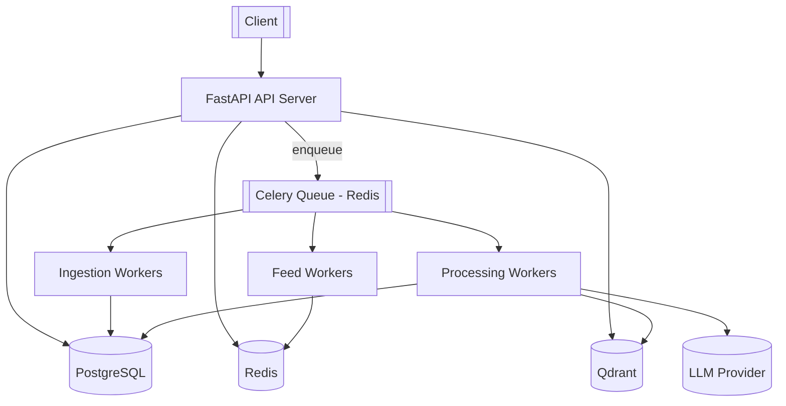

# AI-Personalized News Feed

An AI-powered news aggregation and recommendation backend. It ingests articles
from RSS sources, deduplicates them semantically into canonical **stories**,
enriches them with embeddings, AI summaries and topic labels, learns a per-user
interest vector from interactions, and serves a personalized, diversity-aware
feed over a REST API.

Built as a **modular monolith with background workers** — not microservices.

> **Build status:** Phases 1–4 complete (foundation, APIs, RSS ingestion +
> Celery, embeddings + Qdrant + semantic deduplication into stories). See the
> roadmap below.

---

## 1. Architecture



**Layering**

| Flow | Path |
| --- | --- |
| API request | `API route → Service → Repository` |
| Background job | `Celery task → Service → Repository / AI provider` |

Domain logic lives in `services/`; HTTP concerns stay in `api/`; persistence is
isolated in `repositories/`.

---

## 2. Technology stack

Python 3.12 · FastAPI · Pydantic v2 · SQLAlchemy 2 (async) · Alembic ·
PostgreSQL 16 · Redis 7 · Celery 5 · Qdrant · sentence-transformers ·
OpenAI-compatible LLM (behind an abstraction) · Prometheus · structlog ·
Docker Compose · GitHub Actions · pytest.

---

## 3. Project structure

```
app/
├── main.py               # app factory, middleware, wiring
├── api/v1/                # routers (health now; users/articles/feed/interactions next)
├── core/                  # config, logging, exceptions, security seam, metrics
├── db/                    # async engine/session, declarative base, models
│   └── models/            # user, interest, story, article, interaction, processing
├── schemas/               # Pydantic request/response models
├── repositories/          # data-access layer (holds the UoW session, never commits)
├── services/              # domain logic (raises typed AppError subclasses)
├── ai/                    # embeddings (provider ABC + sentence-transformers); llm/summarizer/classifier (Phase 5)
├── vector/                # Qdrant client, collection spec, search wrapper
├── cache/                 # Redis client (feed cache in Phase 7)
├── workers/               # celery app + task modules           (Phase 3+)
├── ingestion/             # RSS/news sources + normalizer       (Phase 3)
└── ranking/               # scorer, freshness, diversity        (Phase 6/7)
migrations/                # Alembic
tests/                     # unit + integration
docker/ monitoring/ scripts/ .github/workflows/
```

---

## 4. Database schema

```mermaid
erDiagram
    USERS ||--o{ USER_INTERESTS : has
    INTERESTS ||--o{ USER_INTERESTS : tagged_by
    USERS ||--o{ INTERACTIONS : performs
    STORIES ||--o{ ARTICLES : groups
    ARTICLES ||--o{ INTERACTIONS : receives
    ARTICLES ||--o{ PROCESSING_JOBS : tracked_by

    USERS { uuid id PK; string email UK; string name; timestamptz created_at; timestamptz updated_at }
    INTERESTS { uuid id PK; string name UK; timestamptz created_at }
    USER_INTERESTS { uuid user_id PK,FK; uuid interest_id PK,FK; float weight; timestamptz created_at }
    STORIES { uuid id PK; string canonical_title; text summary; timestamptz created_at; timestamptz updated_at }
    ARTICLES { uuid id PK; uuid story_id FK; string title; text description; text content; string url UK; string source; timestamptz published_at; string embedding_reference; enum processing_status; timestamptz created_at }
    INTERACTIONS { uuid id PK; uuid user_id FK; uuid article_id FK; enum interaction_type; timestamptz created_at }
    PROCESSING_JOBS { uuid id PK; uuid article_id FK; enum status; int retry_count; text error; timestamptz started_at; timestamptz completed_at }
```

Enums: `interaction_type` (VIEW, CLICK, LIKE, DISLIKE, SAVE, SKIP, SHARE),
`article_processing_status` / `processing_job_status` (PENDING, PROCESSING,
COMPLETED, FAILED).

---

## 5. Local setup

### Option A — Docker (recommended)

```bash
cp .env.example .env
docker compose up --build
```

The `api` container waits for Postgres, runs `alembic upgrade head`, then serves
on <http://localhost:8000>. Open <http://localhost:8000/docs>.

With Prometheus + Grafana:

```bash
docker compose --profile observability up --build
```

### Option B — Native (for tests / iteration)

```bash
python -m venv .venv && source .venv/bin/activate
pip install -e ".[dev]"
cp .env.example .env            # point hosts at localhost
docker compose up -d postgres redis qdrant
alembic upgrade head
uvicorn app.main:app --reload

# in another shell — the Celery worker
celery -A app.workers.celery_app.celery_app worker --beat --loglevel=INFO
```

> **macOS note:** PyTorch + the Celery `prefork` pool crash on `fork()`. For a
> native worker on macOS use `--pool=solo` (or `--pool=threads`), or export
> `OBJC_DISABLE_INITIALIZE_FORK_SAFETY=YES`. The Docker worker (Linux) is
> unaffected.

---

## 6. Environment variables

All configuration is environment-driven (`app/core/config.py`). Nothing is
hardcoded. See [`.env.example`](.env.example) for the full annotated list. Key
groups: application, security/rate-limit, PostgreSQL, Redis, Qdrant, embeddings,
LLM, news ingestion, `SEMANTIC_DUPLICATE_THRESHOLD`, topic taxonomy, interaction
weights, ranking weights, feed cache TTL, Celery retry policy.

---

## 7. Database migrations

```bash
alembic upgrade head                       # apply
alembic revision --autogenerate -m "msg"   # create (review the output!)
alembic downgrade -1                        # roll back one
# via compose:
make migrate
make revision m="add X"
```

Production startup does **not** auto-create tables — migrations are the only
schema authority.

---

## 8. API

### Operational

| Method | Path | Purpose |
| --- | --- | --- |
| GET | `/health` | Liveness |
| GET | `/ready` | Readiness — checks PostgreSQL, Redis, Qdrant |
| GET | `/metrics` | Prometheus exposition |
| GET | `/docs` | OpenAPI UI |

### v1 (`/api/v1`)

| Method | Path | Purpose |
| --- | --- | --- |
| POST | `/users` | Create a user (`201`, `409` on duplicate email) |
| GET | `/users/{user_id}` | Fetch a user (`404` if absent) |
| POST | `/users/{user_id}/interests` | Add/replace interest weights (idempotent upsert) |
| GET | `/users/{user_id}/interests` | List a user's interests |
| GET | `/articles` | Cursor-paginated list; filters: `source`, `status`, `limit`, `cursor` |
| GET | `/articles/{article_id}` | Article detail |
| POST | `/interactions` | Record VIEW/CLICK/LIKE/DISLIKE/SAVE/SKIP/SHARE (`404` if user/article unknown) |
| POST | `/admin/ingest` | Trigger ingestion. `202` + `task_id` (async), or `{"run_sync": true}` to run in-process and get the per-source report |

*Coming:* `GET /api/v1/feed` (Phase 6).

All errors share one envelope: `{"error": {"code": "...", "message": "..."}}`.
Every response carries `X-Request-Id`.

### Example curl

```bash
API=http://localhost:8000/api/v1

# create a user
USER=$(curl -s -XPOST $API/users -H 'content-type: application/json' \
  -d '{"email":"ada@example.com","name":"Ada"}')
UID=$(echo "$USER" | jq -r .id)

# assign interests (weights are configurable signals, not hardcoded)
curl -s -XPOST $API/users/$UID/interests -H 'content-type: application/json' \
  -d '{"items":[{"name":"Artificial Intelligence","weight":3},{"name":"Cloud","weight":1.5}]}'

# page through articles
curl -s "$API/articles?limit=20"
curl -s "$API/articles?limit=20&cursor=<next_cursor-from-previous-response>"

# record an interaction
curl -s -XPOST $API/interactions -H 'content-type: application/json' \
  -d "{\"user_id\":\"$UID\",\"article_id\":\"<article-uuid>\",\"interaction_type\":\"LIKE\"}"

# ingest news now (async — needs a running worker)
curl -s -XPOST $API/admin/ingest -H 'content-type: application/json' -d '{}'
# ingest synchronously and see what each feed returned
curl -s -XPOST $API/admin/ingest -H 'content-type: application/json' -d '{"run_sync":true}'
```

---

## 9. Observability

- **Structured logs:** one JSON object per line (structlog). Middleware binds
  `request_id` (returned as `X-Request-Id`); workers will bind `task_id`,
  `article_id`, `user_id`.
- **Metrics:** defined in `app/core/metrics.py`, exposed at `/metrics`
  (`http_requests_total`, `feed_cache_hits_total`, `llm_latency_seconds`, …).

---

## 10. Testing

```bash
pytest -q                     # all
pytest --cov=app              # with coverage
```

- **Unit** (`tests/unit/`, no infra): config, model metadata, cursor
  encode/decode, interaction weighting, RSS entry mapping, article normalizer,
  retry backoff, embedding provider (mocked model), **semantic dedup logic**
  (empty index, attach-to-story, threshold boundary, neighbour back-fill).
- **Integration** (`tests/integration/`, real PostgreSQL + Qdrant): user CRUD +
  conflicts, interest upsert, article pagination, interaction persistence,
  ingestion (counts, idempotency, source isolation), processing pipeline (state
  machine + story assignment + embedding reference), **semantic dedup against a
  live Qdrant collection** (first article → story, near-duplicate → same story,
  unrelated → new story), `POST /admin/ingest` sync + async. Each test runs in a
  rolled-back transaction; Qdrant tests use a throwaway collection. Set
  `TEST_DATABASE_URL` / `TEST_QDRANT_URL`; tests skip (don't fail) if unreachable.

Scoring, dedup, profile-building and cache tests are added alongside their
features in later phases.

---

## 11. News ingestion & processing

### Ingestion flow

```
RSS feed URLs (NEWS_RSS_FEEDS)
  → RSSNewsSource.fetch()      HTTP GET + feedparser (no site scraping)
  → normalize()                strip HTML, unescape, collapse WS, clamp lengths,
                               require http(s) URL + title; drop the rest
  → stage-1 dedup              skip URLs already in the batch or in the DB
  → ArticleRepository.create   persist (url is UNIQUE — ingestion is idempotent)
  → ProcessingJob(PENDING)     + enqueue process_article(article_id)
```

`NewsSource` is an ABC; `RSSNewsSource` is the reference implementation and
`NewsAPISource` (disabled unless `NEWS_API_ENABLED=true`) demonstrates the seam.
A failing source is isolated — its `SourceReport` carries the error and the
other sources still run.

### Celery worker architecture

- **Broker/back-end:** Redis (`CELERY_BROKER_URL`, `CELERY_RESULT_BACKEND`).
- **Tasks:** `ingest_news` (all feeds; also on a beat schedule every
  `INGEST_INTERVAL_MINUTES`) and `process_article` (per-article pipeline).
- **Sync ↔ async bridge:** `app/workers/runtime.py` gives each task run a fresh
  `NullPool` async engine + one committed session, avoiding event-loop reuse
  bugs. Services stay async and are shared verbatim with the API.
- **Reliability:** `acks_late`, `prefetch_multiplier=1`, bounded retries
  (`TASK_MAX_RETRIES`) with exponential backoff
  (`TASK_RETRY_BACKOFF_SECONDS * 2**attempt`). Transient errors (Qdrant/LLM/
  network) retry; everything else fails the job immediately. `ProcessingJob`
  records status, `retry_count` and the last error; `worker_failures_total`
  counts failures by task.
- **Idempotency:** re-running `ingest_news` inserts nothing new;
  `process_article` no-ops on an already-`COMPLETED` job.

> The `process_article` pipeline body (clean → embed → dedup → classify →
> summarize) is a no-op in Phase 3 — it only advances job/article state. Phases
> 4–5 fill it in.

### Embeddings

`EmbeddingProvider` ABC → `SentenceTransformerEmbeddingProvider` (local, offline,
model from `EMBEDDING_MODEL` — **not hardcoded**). The model loads lazily once
per process and `encode` runs in a worker thread. `get_embedding_provider()`
selects the implementation from `EMBEDDING_PROVIDER`. Vectors are L2-normalized
and stored in Qdrant (`QDRANT_COLLECTION`, cosine distance,
`QDRANT_VECTOR_SIZE` must match the model — 384 for MiniLM-L6-v2).

### Two-stage deduplication

1. **URL-level (stage 1):** cheap; prevents re-fetching/re-embedding articles we
   already have.
2. **Semantic (stage 2):** `build_embedding_text(article)` → embed → Qdrant
   nearest-neighbour search (top `DEDUP_TOP_K`, excluding self) → if the best
   cosine similarity ≥ `SEMANTIC_DUPLICATE_THRESHOLD` attach the article to that
   neighbour's `Story` (creating one and back-filling the neighbour if it has
   none), otherwise open a new `Story`. The article's vector is then upserted so
   it can match future arrivals.

**PostgreSQL is the source of truth for `story_id`.** The Qdrant payload keeps a
copy for debugging but grouping decisions always re-read the neighbour's current
story from the database — no stale-payload merges.

> `SEMANTIC_DUPLICATE_THRESHOLD=0.90` is a **starting point, not a proven
> optimum**. It trades false merges (too low) against missed duplicates (too
> high) and is model-dependent — evaluate it against a labelled sample of your
> real feeds before trusting it.

### `process_article` pipeline (Phase 4)

```
mark PROCESSING
  → build_embedding_text(title + description|content, truncated to EMBEDDING_MAX_CHARS)
  → embed
  → semantic dedup → assign story_id + embedding_reference, upsert vector
  → (Phase 5: classify + summarize)
mark COMPLETED
```

Embedding/Qdrant/network failures are wrapped as `UpstreamError` → retried with
exponential backoff; a missing article is a permanent failure.

### Local end-to-end

```bash
docker compose up --build                       # api + worker + infra
curl -s -XPOST localhost:8000/api/v1/admin/ingest -d '{}' -H 'content-type: application/json'
docker compose exec postgres psql -U newsfeed -d newsfeed \
  -c "select processing_status, count(*) from articles group by 1;"
```

---

## 12. Roadmap

| Phase | Scope | Status |
| --- | --- | --- |
| 1 | Foundation: config, DB, models, Alembic, FastAPI, health, Docker, CI | ✅ |
| 2 | User / article / interaction APIs (service + repository layers, cursor pagination) | ✅ |
| 3 | RSS ingestion (idempotent), Celery workers, Redis, `POST /admin/ingest` | ✅ |
| 4 | Embeddings (sentence-transformers), Qdrant, semantic dedup into stories | ✅ |
| 5 | LLM summaries + topic classification | ⏳ |
| 6 | User profile vector, recommendation engine, ranking | ⏳ |
| 7 | Feed caching, cursor pagination, diversity | ⏳ |
| 8 | Prometheus/Grafana dashboards, log enrichment | ⏳ |
| 9 | Full test matrix, CI/CD, production hardening | ⏳ |

---

## 13. Design tradeoffs

- **Modular monolith, not microservices** — one deployable, clear module
  boundaries; workers scale independently via the queue.
- **psycopg3 for sync + async** — one driver for the app (async) and Alembic
  (sync), fewer moving parts.
- **Qdrant owns vectors, Postgres owns truth** — articles store only an
  `embedding_reference`; dedup re-reads `story_id` from Postgres, never trusts
  the vector payload.
- **Local, offline embeddings** — sentence-transformers keeps ingestion free and
  network-independent; the `EmbeddingProvider` ABC leaves room for a hosted
  provider later.
- **Transparent scoring, no ML ranker** — the feed score is a documented linear
  combination with configurable weights; explainable and testable first.
