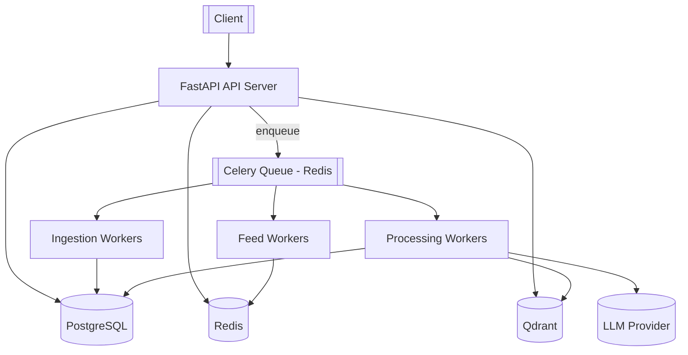

# AI-Personalized News Feed

An AI-powered news aggregation and recommendation backend. It ingests articles
from RSS sources, deduplicates them semantically into canonical **stories**,
enriches them with embeddings, AI summaries and topic labels, learns a per-user
interest vector from interactions, and serves a personalized, diversity-aware
feed over a REST API.

Built as a **modular monolith with background workers** — not microservices.

> **Build status:** all 9 phases complete. Full ingestion → dedup → enrichment →
> personalized ranked feed, with Redis caching, observability, and production
> hardening. 164 tests, ~87% coverage, green CI.

---

## 1. Architecture



**Layering**

| Flow | Path |
| --- | --- |
| API request | `API route → Service → Repository` |
| Background job | `Celery task → Service → Repository / AI provider` |

Domain logic lives in `services/`; HTTP concerns stay in `api/`; persistence is
isolated in `repositories/`.

---

## 2. Technology stack

Python 3.12 · FastAPI · Pydantic v2 · SQLAlchemy 2 (async) · Alembic ·
PostgreSQL 16 · Redis 7 · Celery 5 · Qdrant · sentence-transformers ·
OpenAI-compatible LLM (behind an abstraction) · Prometheus · structlog ·
Docker Compose · GitHub Actions · pytest.

---

## 3. Project structure

```
app/
├── main.py               # app factory, middleware chain (CORS · request-context · rate-limit · security-headers)
├── api/v1/                # routers: users, articles, stories, feed, interactions, admin, health + deps
├── core/                  # config, logging, exceptions, security seam, metrics, pagination, rate_limit
├── db/                    # async engine/session, declarative base, models
│   └── models/            # user, interest, story, article, interaction, processing, profile
├── schemas/               # Pydantic request/response models
├── repositories/          # data-access layer (holds the UoW session, never commits)
├── services/              # domain logic (raises typed AppError subclasses)
├── ai/                    # embedding + llm provider ABCs, summarizer, classifier, JSON recovery, profile_builder
├── vector/                # Qdrant client, collection spec, search wrapper
├── cache/                 # Redis client + per-user feed snapshot cache
├── workers/               # celery app (+ lifecycle/metrics signals), ingest/process/feed tasks, dispatch, sync↔async runtime
├── ingestion/             # RSS/news sources + normalizer
└── ranking/               # scorer (linear), freshness (decay), diversity (rarity + interleave)
migrations/                # Alembic (0001 schema · 0002 enrichment fields · 0003 user_profiles)
tests/                     # unit + integration (+ _fakes.py)
docker/ monitoring/ scripts/ .github/workflows/
```

---

## 4. Database schema

```mermaid
erDiagram
    USERS ||--o{ USER_INTERESTS : has
    INTERESTS ||--o{ USER_INTERESTS : tagged_by
    USERS ||--o{ INTERACTIONS : performs
    STORIES ||--o{ ARTICLES : groups
    ARTICLES ||--o{ INTERACTIONS : receives
    ARTICLES ||--o{ PROCESSING_JOBS : tracked_by

    USERS { uuid id PK; string email UK; string name; timestamptz created_at; timestamptz updated_at }
    INTERESTS { uuid id PK; string name UK; timestamptz created_at }
    USER_INTERESTS { uuid user_id PK,FK; uuid interest_id PK,FK; float weight; timestamptz created_at }
    STORIES { uuid id PK; string canonical_title; text summary; timestamptz created_at; timestamptz updated_at }
    ARTICLES { uuid id PK; uuid story_id FK; string title; text description; text content; string url UK; string source; timestamptz published_at; string embedding_reference; enum processing_status; timestamptz created_at }
    INTERACTIONS { uuid id PK; uuid user_id FK; uuid article_id FK; enum interaction_type; timestamptz created_at }
    PROCESSING_JOBS { uuid id PK; uuid article_id FK; enum status; int retry_count; text error; timestamptz started_at; timestamptz completed_at }
```

Enums: `interaction_type` (VIEW, CLICK, LIKE, DISLIKE, SAVE, SKIP, SHARE),
`article_processing_status` / `processing_job_status` (PENDING, PROCESSING,
COMPLETED, FAILED).

---

## 5. Local setup

### Option A — Docker (recommended)

```bash
cp .env.example .env
docker compose up --build
```

The `api` container waits for Postgres, runs `alembic upgrade head`, then serves
on <http://localhost:8000>. Open <http://localhost:8000/docs>.

With Prometheus + Grafana:

```bash
docker compose --profile observability up --build
```

### Option B — Native (for tests / iteration)

```bash
python -m venv .venv && source .venv/bin/activate
pip install -e ".[dev]"
cp .env.example .env            # point hosts at localhost
docker compose up -d postgres redis qdrant
alembic upgrade head
uvicorn app.main:app --reload

# in another shell — the Celery worker
celery -A app.workers.celery_app.celery_app worker --beat --loglevel=INFO
```

> **macOS note:** PyTorch + the Celery `prefork` pool crash on `fork()`. For a
> native worker on macOS use `--pool=solo` (or `--pool=threads`), or export
> `OBJC_DISABLE_INITIALIZE_FORK_SAFETY=YES`. The Docker worker (Linux) is
> unaffected.

---

## 6. Environment variables

All configuration is environment-driven (`app/core/config.py`). Nothing is
hardcoded. See [`.env.example`](.env.example) for the full annotated list. Key
groups: application, security/rate-limit, PostgreSQL, Redis, Qdrant, embeddings,
LLM, news ingestion, `SEMANTIC_DUPLICATE_THRESHOLD`, topic taxonomy, interaction
weights, ranking weights, feed cache TTL, Celery retry policy.

---

## 7. Database migrations

```bash
alembic upgrade head                       # apply
alembic revision --autogenerate -m "msg"   # create (review the output!)
alembic downgrade -1                        # roll back one
# via compose:
make migrate
make revision m="add X"
```

Production startup does **not** auto-create tables — migrations are the only
schema authority.

---

## 8. API

### Operational

| Method | Path | Purpose |
| --- | --- | --- |
| GET | `/health` | Liveness |
| GET | `/ready` | Readiness — checks PostgreSQL, Redis, Qdrant |
| GET | `/metrics` | Prometheus exposition |
| GET | `/docs` | OpenAPI UI |

### v1 (`/api/v1`)

| Method | Path | Purpose |
| --- | --- | --- |
| POST | `/users` | Create a user (`201`, `409` on duplicate email) |
| GET | `/users/{user_id}` | Fetch a user (`404` if absent) |
| POST | `/users/{user_id}/interests` | Add/replace interest weights (idempotent upsert) |
| GET | `/users/{user_id}/interests` | List a user's interests |
| GET | `/articles` | Cursor-paginated list; filters: `source`, `status`, `limit`, `cursor` |
| GET | `/articles/{article_id}` | Article detail (incl. `topics`) |
| GET | `/stories` | Cursor-paginated stories (canonical title, AI summary, key points, topics) |
| GET | `/stories/{story_id}` | Story detail — summary, key points, topics, source list, member articles |
| GET | `/feed` | Personalized ranked stories for `X-User-Id`. `?limit=`, `?cursor=` (opaque), `?debug=true` for the per-feature score breakdown. Returns `{items, next_cursor, cold_start}` |
| POST | `/interactions` | Record VIEW/CLICK/LIKE/DISLIKE/SAVE/SKIP/SHARE (`404` if user/article unknown); triggers a profile rebuild |
| POST | `/admin/ingest` | Trigger ingestion. `202` + `task_id` (async), or `{"run_sync": true}` to run in-process and get the per-source report |
| POST | `/admin/profile/{user_id}/rebuild` | Synchronously rebuild a user's interest vector (normally a Celery task) |

*Coming:* `GET /api/v1/feed` (Phase 6).

All errors share one envelope: `{"error": {"code": "...", "message": "..."}}`.
Every response carries `X-Request-Id`.

### Example curl

```bash
API=http://localhost:8000/api/v1

# create a user
USER=$(curl -s -XPOST $API/users -H 'content-type: application/json' \
  -d '{"email":"ada@example.com","name":"Ada"}')
UID=$(echo "$USER" | jq -r .id)

# assign interests (weights are configurable signals, not hardcoded)
curl -s -XPOST $API/users/$UID/interests -H 'content-type: application/json' \
  -d '{"items":[{"name":"Artificial Intelligence","weight":3},{"name":"Cloud","weight":1.5}]}'

# page through articles
curl -s "$API/articles?limit=20"
curl -s "$API/articles?limit=20&cursor=<next_cursor-from-previous-response>"

# record an interaction
curl -s -XPOST $API/interactions -H 'content-type: application/json' \
  -d "{\"user_id\":\"$UID\",\"article_id\":\"<article-uuid>\",\"interaction_type\":\"LIKE\"}"

# ingest news now (async — needs a running worker)
curl -s -XPOST $API/admin/ingest -H 'content-type: application/json' -d '{}'
# ingest synchronously and see what each feed returned
curl -s -XPOST $API/admin/ingest -H 'content-type: application/json' -d '{"run_sync":true}'
```

---

## 9. Observability

### Structured logging

One JSON object per line (structlog, bridged to stdlib so uvicorn / SQLAlchemy /
Celery all flow through it). A `contextvars` binder attaches correlation IDs that
then appear on **every** downstream log line and metric-adjacent event:

| Key | Bound by | Scope |
| --- | --- | --- |
| `request_id` | HTTP middleware (accepts inbound `X-Request-Id`, always returns it) | the request |
| `user_id` | HTTP middleware (from `X-User-Id`); profile/feed tasks | request / task |
| `task_id`, `task_name` | `task_prerun` Celery signal | the task |
| `article_id` | `process_article` | the task |
| `request_id` (on a task) | forwarded as a Celery header by `app/workers/dispatch.py` | the task it enqueued |

So an API request → enqueued task → its logs all share one `request_id`.

### Metrics

Defined once in [app/core/metrics.py](app/core/metrics.py) against the default
registry (shared by API and workers).

- **API** exposes `GET /metrics`.
- **Worker** runs a Prometheus HTTP server on `WORKER_METRICS_PORT` (9100),
  started from a Celery signal.

`articles_ingested_total` · `articles_processed_total` ·
`duplicate_articles_total{stage}` · `embedding_requests_total` /
`embedding_latency_seconds` · `llm_requests_total` / `llm_latency_seconds` ·
`feed_requests_total` · `feed_generation_latency_seconds` ·
`feed_cache_hits_total` / `feed_cache_misses_total` · `worker_failures_total{task}` ·
`celery_tasks_total{task,state}` / `celery_task_latency_seconds` ·
`http_requests_total{method,path,status}` / `http_request_latency_seconds`.

### Dashboards

```bash
docker compose --profile observability up --build
```

- Prometheus — <http://localhost:9090> (scrapes `api:8000` and `worker:9100`)
- Grafana — <http://localhost:3000> (anonymous admin); the **AI News Feed**
  dashboard is auto-provisioned from
  [monitoring/grafana/dashboards/news-feed.json](monitoring/grafana/dashboards/news-feed.json)
  — API traffic/latency/errors, feed cache hit ratio + latency, ingestion &
  processing rates, worker failures, embedding & LLM latency.

### Health

`GET /health` (liveness) · `GET /ready` (checks PostgreSQL, Redis, Qdrant
concurrently; `503` if any is down).

---

## 10. Testing

```bash
pytest -q                                    # all (skips infra tests if PG/Qdrant absent)
pytest --cov=app --cov-report=term-missing   # coverage (CI gate: 80%; currently ~87%)
```

**164 tests.** Unit tests need no infrastructure; integration tests need
PostgreSQL (+ Qdrant for the vector paths) and each runs inside a transaction
that is rolled back. Set `TEST_DATABASE_URL` / `TEST_QDRANT_URL`; a test **skips
(does not fail)** when its backend is unreachable. Redis is faked with
`fakeredis`.

- **Unit** (`tests/unit/`): config + production-config guard, model metadata,
  cursor codecs, interaction weighting, RSS mapping, normalizer, retry backoff,
  embedding provider (mocked model), semantic dedup logic, LLM JSON recovery,
  summarizer (recover / re-prompt / exhaust / extractive), classifier
  (taxonomy filter + keyword fallback), profile builder, freshness decay,
  ranking scorer, diversity (rarity + deterministic interleave), metric
  registration, log-context binder, Celery observability signals.
- **Integration** (`tests/integration/`): user / article / story / interaction
  flows, ingestion (counts, idempotency, source isolation), processing pipeline
  (dedup + enrichment + `LLMOutputError` → job FAILED), semantic dedup vs a live
  Qdrant collection, enrichment, profile rebuild, recommendation
  (relevant > irrelevant, dislike/consumed exclusion, cold start), `GET /feed`
  (auth, cold start, `?debug`, snapshot pagination, bad cursor → 422), feed
  cache (hit/miss, TTL, eviction), feed diversity, `GET /stories`,
  `POST /admin/ingest`, the sync↔async worker runtime, and hardening
  (rate-limit 429 + fail-open + exemptions, security headers).

### CI ([.github/workflows/ci.yml](.github/workflows/ci.yml))

Three jobs on every push / PR: **lint** (`ruff check`, `ruff format --check`,
`mypy` advisory) · **test** (Postgres + Redis + Qdrant services, `alembic
upgrade head`, `alembic check` for drift, `pytest --cov-fail-under=80`) ·
**docker-build** (builds the image with layer caching).

---

## 11. News ingestion & processing

### Ingestion flow

```
RSS feed URLs (NEWS_RSS_FEEDS)
  → RSSNewsSource.fetch()      HTTP GET + feedparser (no site scraping)
  → normalize()                strip HTML, unescape, collapse WS, clamp lengths,
                               require http(s) URL + title; drop the rest
  → stage-1 dedup              skip URLs already in the batch or in the DB
  → ArticleRepository.create   persist (url is UNIQUE — ingestion is idempotent)
  → ProcessingJob(PENDING)     + enqueue process_article(article_id)
```

`NewsSource` is an ABC; `RSSNewsSource` is the reference implementation and
`NewsAPISource` (disabled unless `NEWS_API_ENABLED=true`) demonstrates the seam.
A failing source is isolated — its `SourceReport` carries the error and the
other sources still run.

### Celery worker architecture

- **Broker/back-end:** Redis (`CELERY_BROKER_URL`, `CELERY_RESULT_BACKEND`).
- **Tasks:** `ingest_news` (all feeds; also on a beat schedule every
  `INGEST_INTERVAL_MINUTES`) and `process_article` (per-article pipeline).
- **Sync ↔ async bridge:** `app/workers/runtime.py` gives each task run a fresh
  `NullPool` async engine + one committed session, avoiding event-loop reuse
  bugs. Services stay async and are shared verbatim with the API.
- **Reliability:** `acks_late`, `prefetch_multiplier=1`, bounded retries
  (`TASK_MAX_RETRIES`) with exponential backoff
  (`TASK_RETRY_BACKOFF_SECONDS * 2**attempt`). Transient errors (Qdrant/LLM/
  network) retry; everything else fails the job immediately. `ProcessingJob`
  records status, `retry_count` and the last error; `worker_failures_total`
  counts failures by task.
- **Idempotency:** re-running `ingest_news` inserts nothing new;
  `process_article` no-ops on an already-`COMPLETED` job.

> The `process_article` pipeline body (clean → embed → dedup → classify →
> summarize) is a no-op in Phase 3 — it only advances job/article state. Phases
> 4–5 fill it in.

### Embeddings

`EmbeddingProvider` ABC → `SentenceTransformerEmbeddingProvider` (local, offline,
model from `EMBEDDING_MODEL` — **not hardcoded**). The model loads lazily once
per process and `encode` runs in a worker thread. `get_embedding_provider()`
selects the implementation from `EMBEDDING_PROVIDER`. Vectors are L2-normalized
and stored in Qdrant (`QDRANT_COLLECTION`, cosine distance,
`QDRANT_VECTOR_SIZE` must match the model — 384 for MiniLM-L6-v2).

### Two-stage deduplication

1. **URL-level (stage 1):** cheap; prevents re-fetching/re-embedding articles we
   already have.
2. **Semantic (stage 2):** `build_embedding_text(article)` → embed → Qdrant
   nearest-neighbour search (top `DEDUP_TOP_K`, excluding self) → if the best
   cosine similarity ≥ `SEMANTIC_DUPLICATE_THRESHOLD` attach the article to that
   neighbour's `Story` (creating one and back-filling the neighbour if it has
   none), otherwise open a new `Story`. The article's vector is then upserted so
   it can match future arrivals.

**PostgreSQL is the source of truth for `story_id`.** The Qdrant payload keeps a
copy for debugging but grouping decisions always re-read the neighbour's current
story from the database — no stale-payload merges.

> `SEMANTIC_DUPLICATE_THRESHOLD=0.90` is a **starting point, not a proven
> optimum**. It trades false merges (too low) against missed duplicates (too
> high) and is model-dependent — evaluate it against a labelled sample of your
> real feeds before trusting it.

### `process_article` pipeline

```
mark PROCESSING
  → build_embedding_text(title + description|content, truncated to EMBEDDING_MAX_CHARS)
  → embed
  → semantic dedup → assign story_id + embedding_reference, upsert vector
  → classify article → article.topics       (LLM, else keyword fallback)
  → if story has no summary: summarize → story.summary / key_points / topics
    else: merge topics onto the story
mark COMPLETED
```

Embedding/Qdrant/transient-LLM/network failures → `UpstreamError` → retried with
exponential backoff. A missing article, or LLM output still unparseable after
`LLM_OUTPUT_MAX_ATTEMPTS` re-prompts (`LLMOutputError`), is a **permanent**
failure → job `FAILED`, no infinite retry.

### LLM: summarization & classification

`LLMProvider` ABC → `OpenAIProvider` (works with the OpenAI API **or any
OpenAI-compatible endpoint** via `LLM_BASE_URL` — verified against a local
Ollama). `get_llm_provider()` returns `None` when `LLM_ENABLED=false` or no key
is set.

- **Summarizer** asks for a strict JSON object and validates it with Pydantic
  (`{summary, key_points[], topics[]}`). Malformed output is recovered
  (fenced-JSON / embedded-object extraction), then re-prompted up to
  `LLM_OUTPUT_MAX_ATTEMPTS` times, then `LLMOutputError`. Bad output never
  crashes the worker.
- **Classifier** maps articles to `TOPIC_TAXONOMY` (configurable). Prefers the
  LLM; on **any** LLM failure (transport or malformed) falls back to a
  transparent whole-word keyword matcher so an article is never uncategorized.
- **No LLM configured** → extractive summary (first sentences) + keyword
  classification. The feature degrades, it does not fail.

Article topics roll up onto the story (`Story.topics` = union); the story is
summarized once, when its first article is processed.

### Local end-to-end

```bash
docker compose up --build                       # api + worker + infra
curl -s -XPOST localhost:8000/api/v1/admin/ingest -d '{}' -H 'content-type: application/json'
docker compose exec postgres psql -U newsfeed -d newsfeed \
  -c "select processing_status, count(*) from articles group by 1;"
```

---

## 12. Recommendation & ranking

### User interest vector

Every interaction enqueues `rebuild_user_profile`, which:

```
recent interactions (≤ PROFILE_MAX_INTERACTIONS)
  → signed weight per interaction (INTERACTION_WEIGHT_*, all in config)
  → sum weights per article
  → fetch those article vectors from Qdrant
  → profile = normalize( Σ wᵢ·vᵢ / Σ |wᵢ| )
  → persist to user_profiles (embedding, interaction_count, embedding_model)
```

SKIP/DISLIKE carry negative weights → they push the profile *away* from that
content. `embedding` stays null until there is positive signal. The math is a
pure function ([app/ai/profile_builder.py](app/ai/profile_builder.py)) —
deterministic and unit-tested; the service only does I/O.

### `GET /feed`

```
load profile
  → candidates: Qdrant search(profile vector, FEED_CANDIDATE_POOL)
                → map article hits to stories, keep best score per story
    (cold start / no profile → most-recent stories, semantic term = 0)
  → drop stories the user DISLIKEd, or already consumed (CLICK/VIEW) when
    FEED_EXCLUDE_CONSUMED
  → per-story features, each normalized to [0, 1]:
      semantic        best article-similarity to the profile vector
      freshness       exp(-age_hours / FRESHNESS_DECAY_HOURS)   ← a score, not a sort
      popularity      Σ weightᵢ·countᵢ over VIEW/LIKE/SAVE/SHARE, then min-max
                      across the candidate pool (ONE grouped query — no N+1)
      source_quality  mean SOURCE_QUALITY[source] (else SOURCE_QUALITY_DEFAULT)
      diversity       primary-topic rarity within the pool
  → final = 0.55·sem + 0.20·fresh + 0.10·pop + 0.10·src + 0.05·div   (RANK_WEIGHT_*)
  → sort desc
  → interleave_by_topic(max_streak = FEED_DIVERSITY_MAX_STREAK)   # no 3 same-topic in a row
```

No ML ranker — the score is a documented linear combination and `?debug=true`
returns every feature value and its weighted contribution.

### Feed cache & pagination

```
GET /feed?cursor=…&limit=20
  → decode cursor → offset (opaque base64 of {"o": N}; malformed → 422)
  → Redis GET feed:user:{user_id}
      hit  → feed_cache_hits_total++
      miss → rank_stories() → store snapshot (SET … EX FEED_CACHE_TTL_SECONDS)
             feed_cache_misses_total++ ; feed_generation_latency_seconds observed
  → slice snapshot[offset : offset+limit], hydrate those stories from Postgres
  → next_cursor = {"o": offset+limit}  (null at the end)
```

**One key per user holds the whole ranked snapshot** — every page of a
pagination walk comes from the same ranking, and a single `DEL` invalidates the
entire feed. `InteractionService` drops the key on profile-changing interactions
(`FEED_CACHE_INVALIDATE_TYPES`); `rebuild_user_profile` drops it after
recomputing the vector. A cache outage is swallowed — the feed is still served,
just uncached.

---

## 13. Roadmap

| Phase | Scope | Status |
| --- | --- | --- |
| 1 | Foundation: config, DB, models, Alembic, FastAPI, health, Docker, CI | ✅ |
| 2 | User / article / interaction APIs (service + repository layers, cursor pagination) | ✅ |
| 3 | RSS ingestion (idempotent), Celery workers, Redis, `POST /admin/ingest` | ✅ |
| 4 | Embeddings (sentence-transformers), Qdrant, semantic dedup into stories | ✅ |
| 5 | LLM summaries + topic classification (structured output, offline fallbacks) | ✅ |
| 6 | User profile vector, recommendation engine, transparent ranking, `GET /feed` | ✅ |
| 7 | Redis feed cache (per-user snapshot), opaque cursor pagination, diversity re-ordering, cache invalidation | ✅ |
| 8 | Prometheus (API + worker) + provisioned Grafana dashboard, correlation-ID log enrichment | ✅ |
| 9 | Test matrix (164 tests / ~87%), 3-job CI, rate limiting, prod config guard, security headers | ✅ |

---

## 14. Design tradeoffs

- **Modular monolith, not microservices** — one deployable, clear module
  boundaries; workers scale independently via the queue.
- **psycopg3 for sync + async** — one driver for the app (async) and Alembic
  (sync), fewer moving parts.
- **Qdrant owns vectors, Postgres owns truth** — articles store only an
  `embedding_reference`; dedup re-reads `story_id` from Postgres, never trusts
  the vector payload.
- **Local, offline embeddings** — sentence-transformers keeps ingestion free and
  network-independent; the `EmbeddingProvider` ABC leaves room for a hosted
  provider later.
- **LLM is optional and behind an ABC** — the pipeline runs (with weaker output)
  with no API key at all; `OpenAIProvider` targets any OpenAI-compatible
  endpoint, so swapping model/vendor is a config change.
- **Malformed LLM output is a domain concern, not a crash** — recover, re-prompt
  a bounded number of times, then fail the job cleanly.
- **Transparent ranking before ML** — a linear score with configurable weights is
  explainable (`?debug=true`), testable, and tunable without retraining; an ML
  ranker can replace `score()` later behind the same interface.
- **Profile as a weighted vector average** — cheap to compute, cheap to store
  (one JSONB column), and the same Qdrant search powers both dedup and the feed.
- **One feed-cache key per user, not per page** — the spec's
  `feed:user:{id}:{cursor}` shape is folded into an opaque offset cursor over a
  single cached snapshot. Pagination stays consistent mid-walk and invalidation
  is one `DEL` instead of a key scan; the cost is regenerating the whole snapshot
  on the first miss rather than page-by-page.
- **Transparent scoring, no ML ranker** — the feed score is a documented linear
  combination with configurable weights; explainable and testable first.

---

## 15. Security & production hardening

- **Secrets** are environment-only (`.env` is git-ignored; `.env.example` is the
  template). Nothing — credentials, model names, thresholds, weights — is
  hardcoded.
- **Startup guard:** in `ENVIRONMENT=production` the app refuses to boot if
  `SECRET_KEY` is the default/short, `DEBUG` is on, CORS is `*`, or
  `LLM_ENABLED` is set without a key (`Settings.production_issues()`).
- **Rate limiting:** Redis fixed-window per `X-User-Id` (else client IP),
  `RATE_LIMIT_*` configurable, `/health` · `/ready` · `/metrics` exempt. Returns
  `429` with `Retry-After` and the standard error envelope. **Fails open** if
  Redis is down.
- **CORS:** explicit origin list; `allow_credentials` is auto-disabled if origins
  contain `*` (an invalid combination per the CORS spec).
- **Headers:** `X-Content-Type-Options: nosniff`, `X-Frame-Options: DENY`,
  `Referrer-Policy: no-referrer` on every response.
- **Error responses:** one envelope `{"error": {"code", "message"}}`; internal
  exception detail and stack traces are replaced with a generic message when
  `ENVIRONMENT=production`. OpenAPI docs (`/docs`, `/redoc`, `/openapi.json`) are
  disabled in production.
- **Auth seam:** the dev scheme is an `X-User-Id` header, but `get_current_user_id`
  is the single dependency every route uses — swapping in JWT bearer validation
  touches nothing in the service or repository layers.
- **Containers:** non-root user, per-service healthchecks, `depends_on:
  service_healthy`, and migrations run on API startup (never `create_all`).

---

## 16. Future improvements

- **Auth:** real JWT / OAuth2 (the seam is already in place), API keys for the
  admin endpoints.
- **Ranking:** learning-to-rank model behind `score()`; per-user weight
  personalization; A/B framework on the weight vector; MMR-style diversity
  instead of the greedy interleave.
- **Dedup:** evaluate `SEMANTIC_DUPLICATE_THRESHOLD` against a labelled set;
  cross-encoder re-rank of the top-K before merging; time-windowed story
  expiry so stale events stop absorbing new articles.
- **Scale:** `prometheus_client` multiprocess mode (or a push gateway) for
  multi-worker metrics; read replica for feed queries; Qdrant payload index on
  `published_at` for time-filtered candidate generation; outbox pattern for the
  enqueue-after-commit step.
- **Ops:** OpenTelemetry traces alongside the logs; alert rules on
  `worker_failures_total` and feed p95; Grafana panels per source/topic.
- **Product:** WebSocket/SSE feed updates, "why am I seeing this" from the stored
  contributions, save/read-later lists, digest emails via a beat task.
