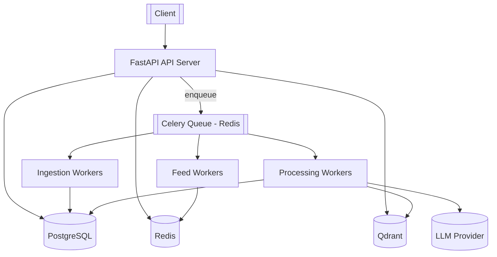

# AI-Personalized News Feed

An AI-powered news aggregation and recommendation backend. It ingests articles
from RSS sources, deduplicates them semantically into canonical **stories**,
enriches them with embeddings, AI summaries and topic labels, learns a per-user
interest vector from interactions, and serves a personalized, diversity-aware
feed over a REST API.

Built as a **modular monolith with background workers** — not microservices.

> **Build status:** Phase 1 complete (foundation: config, DB, models, Alembic,
> FastAPI app, health/metrics, Docker Compose, CI). See the roadmap below.

---

## 1. Architecture



**Layering**

| Flow | Path |
| --- | --- |
| API request | `API route → Service → Repository` |
| Background job | `Celery task → Service → Repository / AI provider` |

Domain logic lives in `services/`; HTTP concerns stay in `api/`; persistence is
isolated in `repositories/`.

---

## 2. Technology stack

Python 3.12 · FastAPI · Pydantic v2 · SQLAlchemy 2 (async) · Alembic ·
PostgreSQL 16 · Redis 7 · Celery 5 · Qdrant · sentence-transformers ·
OpenAI-compatible LLM (behind an abstraction) · Prometheus · structlog ·
Docker Compose · GitHub Actions · pytest.

---

## 3. Project structure

```
app/
├── main.py               # app factory, middleware, wiring
├── api/v1/                # routers (health now; users/articles/feed/interactions next)
├── core/                  # config, logging, exceptions, security seam, metrics
├── db/                    # async engine/session, declarative base, models
│   └── models/            # user, interest, story, article, interaction, processing
├── schemas/               # Pydantic request/response models  (Phase 2+)
├── repositories/          # data-access layer                  (Phase 2+)
├── services/              # domain logic                       (Phase 2+)
├── ai/                    # embeddings + llm providers, summarizer, classifier (Phase 4/5)
├── vector/                # Qdrant client, collections, search  (Phase 4)
├── cache/                 # Redis + feed cache                  (Phase 3/7)
├── workers/               # celery app + task modules           (Phase 3+)
├── ingestion/             # RSS/news sources + normalizer       (Phase 3)
└── ranking/               # scorer, freshness, diversity        (Phase 6/7)
migrations/                # Alembic
tests/                     # unit + integration
docker/ monitoring/ scripts/ .github/workflows/
```

---

## 4. Database schema

```mermaid
erDiagram
    USERS ||--o{ USER_INTERESTS : has
    INTERESTS ||--o{ USER_INTERESTS : tagged_by
    USERS ||--o{ INTERACTIONS : performs
    STORIES ||--o{ ARTICLES : groups
    ARTICLES ||--o{ INTERACTIONS : receives
    ARTICLES ||--o{ PROCESSING_JOBS : tracked_by

    USERS { uuid id PK; string email UK; string name; timestamptz created_at; timestamptz updated_at }
    INTERESTS { uuid id PK; string name UK; timestamptz created_at }
    USER_INTERESTS { uuid user_id PK,FK; uuid interest_id PK,FK; float weight; timestamptz created_at }
    STORIES { uuid id PK; string canonical_title; text summary; timestamptz created_at; timestamptz updated_at }
    ARTICLES { uuid id PK; uuid story_id FK; string title; text description; text content; string url UK; string source; timestamptz published_at; string embedding_reference; enum processing_status; timestamptz created_at }
    INTERACTIONS { uuid id PK; uuid user_id FK; uuid article_id FK; enum interaction_type; timestamptz created_at }
    PROCESSING_JOBS { uuid id PK; uuid article_id FK; enum status; int retry_count; text error; timestamptz started_at; timestamptz completed_at }
```

Enums: `interaction_type` (VIEW, CLICK, LIKE, DISLIKE, SAVE, SKIP, SHARE),
`article_processing_status` / `processing_job_status` (PENDING, PROCESSING,
COMPLETED, FAILED).

---

## 5. Local setup

### Option A — Docker (recommended)

```bash
cp .env.example .env
docker compose up --build
```

The `api` container waits for Postgres, runs `alembic upgrade head`, then serves
on <http://localhost:8000>. Open <http://localhost:8000/docs>.

With Prometheus + Grafana:

```bash
docker compose --profile observability up --build
```

### Option B — Native (for tests / iteration)

```bash
python -m venv .venv && source .venv/bin/activate
pip install -e ".[dev]"
cp .env.example .env            # point hosts at localhost
docker compose up -d postgres redis qdrant
alembic upgrade head
uvicorn app.main:app --reload
```

---

## 6. Environment variables

All configuration is environment-driven (`app/core/config.py`). Nothing is
hardcoded. See [`.env.example`](.env.example) for the full annotated list. Key
groups: application, security/rate-limit, PostgreSQL, Redis, Qdrant, embeddings,
LLM, news ingestion, `SEMANTIC_DUPLICATE_THRESHOLD`, topic taxonomy, interaction
weights, ranking weights, feed cache TTL, Celery retry policy.

---

## 7. Database migrations

```bash
alembic upgrade head                       # apply
alembic revision --autogenerate -m "msg"   # create (review the output!)
alembic downgrade -1                        # roll back one
# via compose:
make migrate
make revision m="add X"
```

Production startup does **not** auto-create tables — migrations are the only
schema authority.

---

## 8. API (Phase 1)

| Method | Path | Purpose |
| --- | --- | --- |
| GET | `/health` | Liveness |
| GET | `/ready` | Readiness — checks PostgreSQL, Redis, Qdrant |
| GET | `/metrics` | Prometheus exposition |
| GET | `/docs` | OpenAPI UI |

```bash
curl -s localhost:8000/health
curl -s localhost:8000/ready | jq
curl -s localhost:8000/metrics | head
```

Endpoints for users, interests, articles, interactions, feed and admin ingest
arrive in later phases.

---

## 9. Observability

- **Structured logs:** one JSON object per line (structlog). Middleware binds
  `request_id` (returned as `X-Request-Id`); workers will bind `task_id`,
  `article_id`, `user_id`.
- **Metrics:** defined in `app/core/metrics.py`, exposed at `/metrics`
  (`http_requests_total`, `feed_cache_hits_total`, `llm_latency_seconds`, …).

---

## 10. Testing

```bash
pytest -q                     # all
pytest --cov=app              # with coverage
```

Unit tests cover config, model metadata and health/metrics wiring today;
scoring, dedup, profile-building, cursor codec and full integration tests are
added alongside their features.

---

## 11. Roadmap

| Phase | Scope | Status |
| --- | --- | --- |
| 1 | Foundation: config, DB, models, Alembic, FastAPI, health, Docker, CI | ✅ |
| 2 | User / article / interaction APIs (service + repository layers) | ⏳ |
| 3 | RSS ingestion, Celery, Redis | ⏳ |
| 4 | Qdrant, embeddings, semantic deduplication | ⏳ |
| 5 | LLM summaries + topic classification | ⏳ |
| 6 | User profile vector, recommendation engine, ranking | ⏳ |
| 7 | Feed caching, cursor pagination, diversity | ⏳ |
| 8 | Prometheus/Grafana dashboards, log enrichment | ⏳ |
| 9 | Full test matrix, CI/CD, production hardening | ⏳ |

---

## 12. Design tradeoffs

- **Modular monolith, not microservices** — one deployable, clear module
  boundaries; workers scale independently via the queue.
- **psycopg3 for sync + async** — one driver for the app (async) and Alembic
  (sync), fewer moving parts.
- **Qdrant owns vectors, Postgres owns truth** — articles store only an
  `embedding_reference`.
- **Transparent scoring, no ML ranker** — the feed score is a documented linear
  combination with configurable weights; explainable and testable first.
